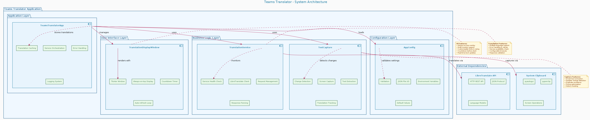
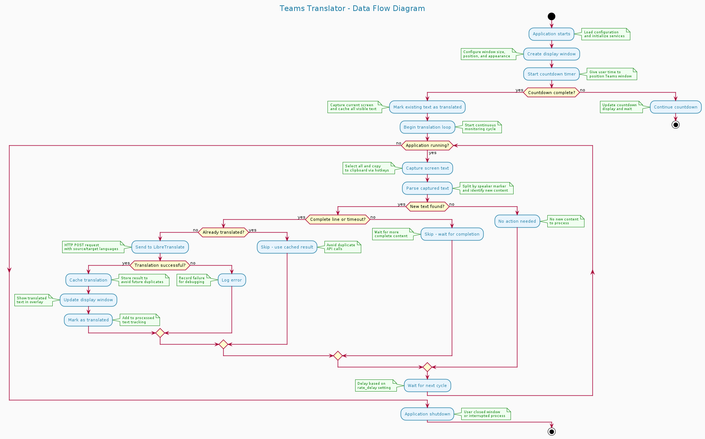

# Architecture Documentation

## Overview

Teams Translator follows a modular architecture designed for maintainability, testability, and extensibility. The application is structured into distinct layers with clear separation of concerns.

## System Architecture

## Class Diagram

## Component Details

### 1. TeamsTranslatorApp (Application Layer)

**Purpose**: Main application orchestrator that coordinates all services and manages the application lifecycle.

**Key Responsibilities**:
- Initialize and manage service instances
- Handle application configuration
- Coordinate text capture and translation workflow
- Manage translation caching
- Handle errors and logging
- Control application startup and shutdown

**Key Methods**:
- `grab_and_translate()`: Main translation workflow
- `check_prerequisites()`: Verify system requirements
- `start_translation_session()`: Initialize translation session
- `run()`: Main application entry point

### 2. TranslationDisplayWindow (UI Layer)

**Purpose**: Manages the translation display window and user interface.

**Key Responsibilities**:
- Create and manage Tkinter window
- Display translated text with proper formatting
- Handle countdown before translation starts
- Manage window positioning and sizing
- Handle window lifecycle events

**Key Methods**:
- `create_window()`: Initialize the display window
- `update_text()`: Update displayed translation
- `start_countdown()`: Handle startup countdown
- `start_translation_updates()`: Begin translation update loop

### 3. TextCapture (Business Logic Layer)

**Purpose**: Handles text capture from the screen and determines what needs translation.

**Key Responsibilities**:
- Capture text using clipboard operations
- Parse captured text to identify new content
- Track translation history to avoid duplicates
- Determine optimal translation timing
- Handle speaker change detection

**Key Methods**:
- `grab_text()`: Capture text from active window
- `get_transcript_to_translate()`: Identify new text for translation
- `mark_all_previous_translated()`: Initialize translation history
- `mark_as_translated()`: Update translation cache

### 4. TranslationService (Business Logic Layer)

**Purpose**: Handles communication with LibreTranslate API for text translation.

**Key Responsibilities**:
- Make HTTP requests to LibreTranslate API
- Handle API response parsing
- Manage translation errors and retries
- Check service availability
- Support multiple languages

**Key Methods**:
- `translate()`: Translate text via API
- `is_service_available()`: Check API availability

### 5. AppConfig (Configuration Layer)

**Purpose**: Manages application configuration with support for files and environment variables.

**Key Responsibilities**:
- Load/save configuration from JSON files
- Provide default configuration values
- Support environment variable overrides
- Validate configuration parameters
- Handle configuration inheritance

**Configuration Sections**:
- `TranslationConfig`: Translation service settings
- `UIConfig`: User interface settings
- `CaptureConfig`: Text capture settings

## Data Flow

### Simplified Data Flow

For a high-level overview of the data flow, see this simplified diagram:

## Sequence Diagram

The following sequence diagram shows the interaction flow during a typical translation session:

## State Diagram

The application state transitions are shown in the following diagram:

## Error Handling Strategy

The application implements comprehensive error handling at multiple levels:

### 1. Service Level Errors
- **LibreTranslate API failures**: Retry logic with exponential backoff
- **Network connectivity issues**: Graceful degradation and user notification
- **Configuration errors**: Validation and default value fallbacks

### 2. System Level Errors
- **Clipboard access failures**: Alternative text capture methods
- **Screen capture issues**: Error logging and user guidance
- **Window management problems**: Fallback to default screen settings

### 3. Application Level Errors
- **Configuration loading failures**: Default configuration creation
- **Service initialization errors**: Prerequisites checking and user feedback
- **Runtime exceptions**: Comprehensive logging and graceful shutdown

## Configuration Management

The application uses a hierarchical configuration system:

1. **Default Values**: Hard-coded sensible defaults
2. **Configuration Files**: JSON files for persistent settings
3. **Environment Variables**: Runtime configuration overrides
4. **Command Line Arguments**: Session-specific overrides

## Security Considerations

- **API Key Management**: Secure storage and transmission of API keys
- **Clipboard Security**: Minimal clipboard access and data sanitization
- **Network Security**: HTTPS support for remote LibreTranslate instances
- **Input Validation**: Comprehensive input sanitization and validation

## Performance Considerations

- **Translation Caching**: Avoid redundant API calls
- **Rate Limiting**: Configurable delays between API requests
- **Memory Management**: Efficient text processing and storage
- **UI Responsiveness**: Non-blocking translation operations

## Extensibility Points

The architecture supports extension through:

1. **Translation Services**: Additional translation providers
2. **Text Capture Methods**: Alternative text capture mechanisms
3. **Display Options**: Different UI frameworks and display modes
4. **Configuration Formats**: Support for YAML, TOML, etc.
5. **Language Support**: Dynamic language detection and switching

## Deployment Architecture

The following diagram shows the deployment architecture and system dependencies:

## Testing Strategy

- **Unit Tests**: Individual component testing
- **Integration Tests**: Service interaction testing
- **End-to-End Tests**: Complete workflow testing
- **Performance Tests**: Load and stress testing
- **Configuration Tests**: Configuration validation testing